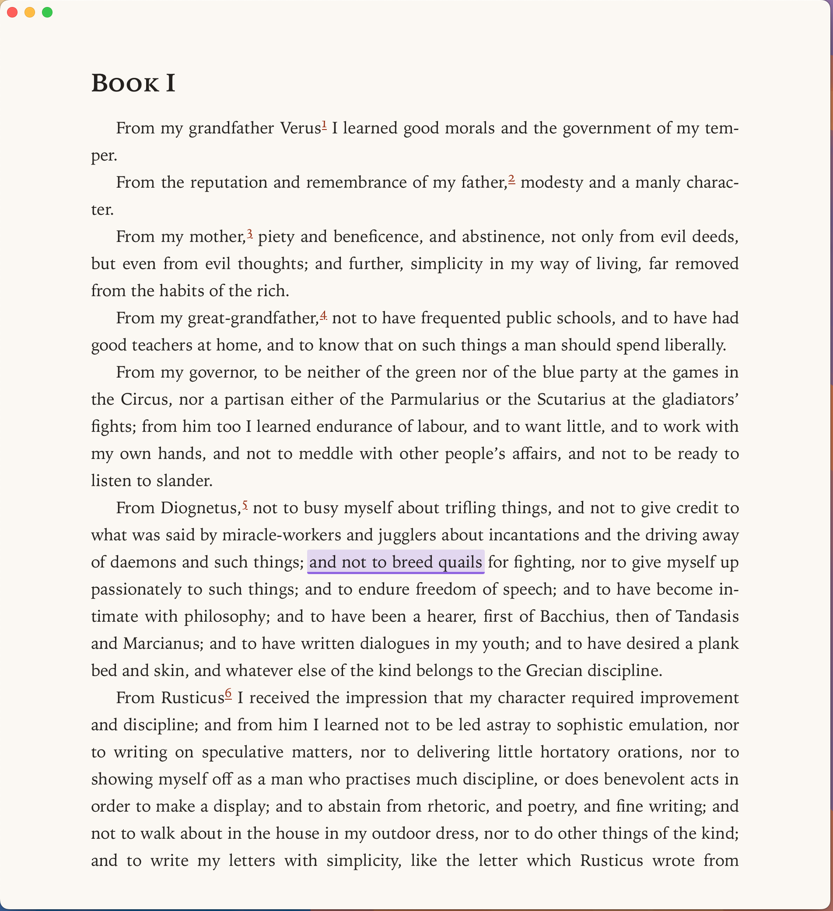
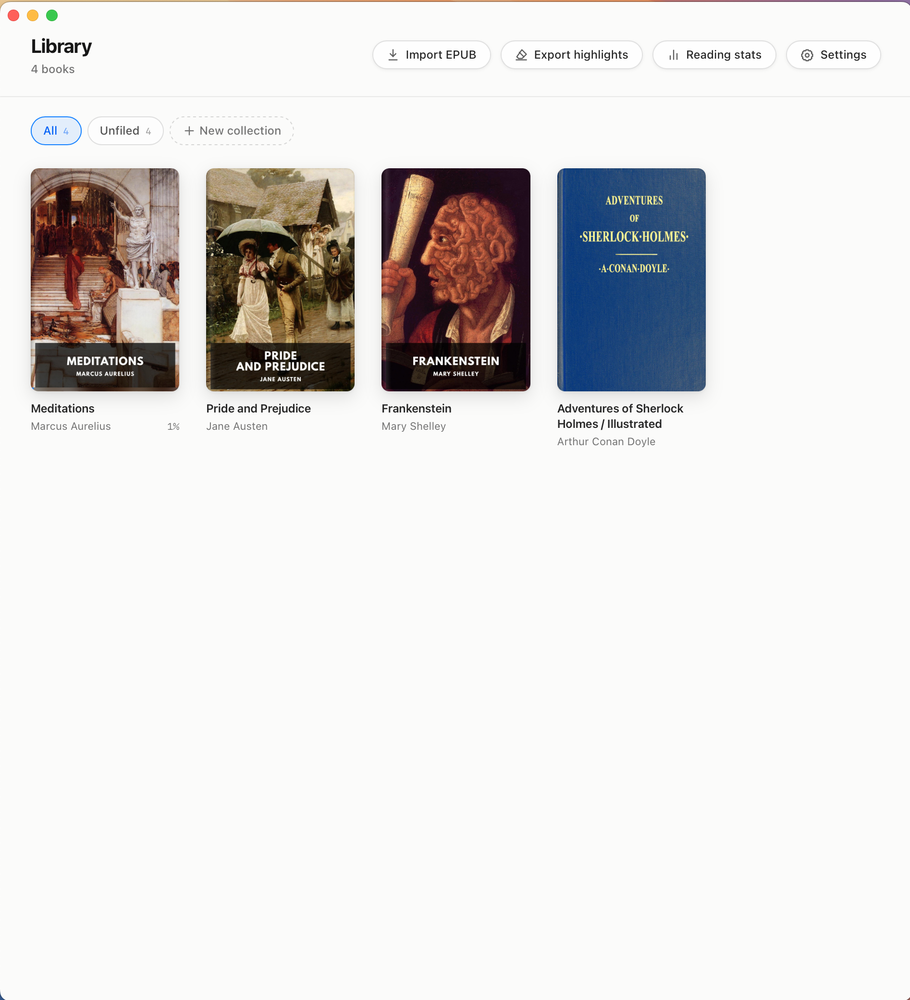
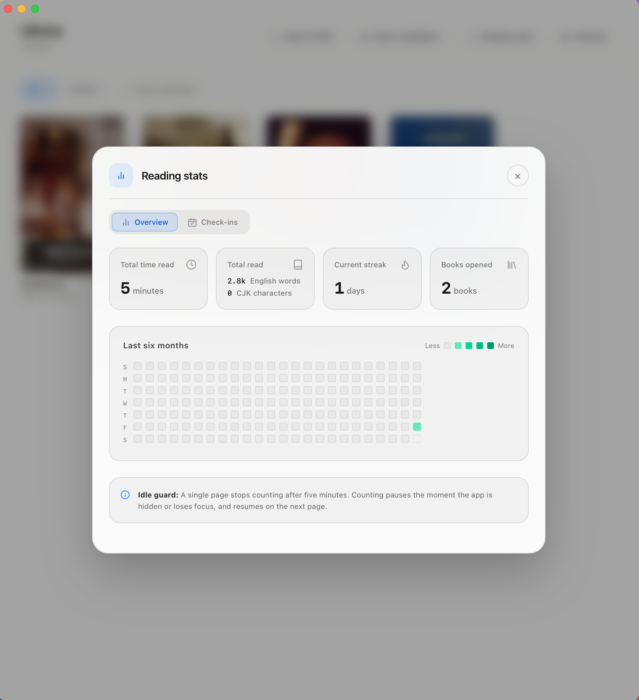

# VeloRead

A clean, elegant, local-first macOS desktop reader (EPUB / TXT / PDF) designed for deep focus reading, reading speed training with an auto-advancing Pacer, structured highlights and annotations, and complete data freedom with plain-text export.

## Features

### 📖 Reader & Auto-Advancing Pacer

- **Immersive Reading**: Customizable typography, 6 aesthetic presets (Classic Book, Parchment, Modern Prose, Academic, Editorial, Chinese Song), light and dark modes, paginated or continuous scrolling, TOC, and bookmarks.
- **Pacer Speed Training**: An auto-advancing highlight that guides your eye movement across words or CJK character chunks, helping train reading speed past subvocalization. Adjustable speed, highlight intensity, and shape.
- **Highlights & Notes**: 5 highlight colors with optional notes, listed alongside TOC/bookmarks, and exportable as standard plain text (`My Clippings` format).

<p align="center">
  
</p>

### 📚 Local Library & Collections

- **Local-First Management**: Drag-and-drop book import, custom collection shelves, reading progress tracking, and fast filtering.
- **Full-Text Search**: Search across entire books with on-demand chapter indexing.

<p align="center">
  
</p>

### 📊 Reading Activity & Statistics

- **Honest Tracking**: Real active reading time (ignoring idle time), separate word and CJK character counters, reading streaks, and daily check-in goals with an activity heatmap.

<p align="center">
  
</p>

## Installation

Download the package for your platform from
[GitHub Releases](https://github.com/fangwangme/VeloRead/releases):

- **macOS** (Universal — Intel and Apple Silicon): `VeloRead_<version>_macOS_universal.dmg` —
  open it and drag `VeloRead.app` into Applications.
- **Linux**:
  - `.deb` (Debian/Ubuntu): `sudo apt install ./VeloRead_<version>_linux_x86_64.deb`
  - `.AppImage` (no install, needs `libfuse2`): `chmod +x VeloRead_<version>_linux_x86_64.AppImage`,
    then run it
  - `.tar.gz` (Arch/Omarchy and other distros): extract and run `usr/bin/veloread` directly, or
    `cp -r usr/* /usr/local/` for menu integration — the layout is also what a PKGBUILD expects

## Build & Run

### Building from Source

```bash
bun install
bun run dev        # frontend only (http://localhost:5174) — fast UI iteration
bun run app:dev    # full desktop app (Tauri v2 + SQLite)
bun run app:build  # package the host platform's app into .local/release/<version>/
bun run lint       # eslint
bun run test       # vitest unit tests
bun run build      # tsc -b && vite build
```

**Prerequisites:**
- [bun](https://bun.sh)
- Rust toolchain ([rustup](https://rustup.rs))
- **macOS**: Xcode Command Line Tools (`xcode-select --install`)
- **Linux**: see [`docs/usage/build.md`](docs/usage/build.md#前置依赖) for the WebKitGTK/GTK
  packages the build needs

## Tech Stack

Tauri v2 (Rust + WKWebView) · React 19 · TypeScript · Vite 7 · Tailwind CSS 4

## Documentation

- **Specs & Architecture:** [`docs/specs/overview.md`](docs/specs/overview.md) and module specs in [`docs/specs/`](docs/specs/)
- **Build & Packaging Guide:** [`docs/usage/build.md`](docs/usage/build.md)
- **Changelog:** [`CHANGELOG.md`](CHANGELOG.md)
- **Contributor & Agent Conventions:** [`AGENTS.md`](AGENTS.md)

## License

MIT
